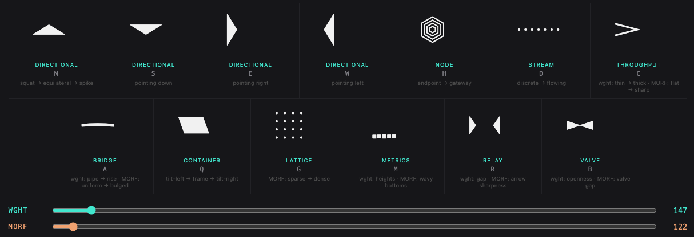
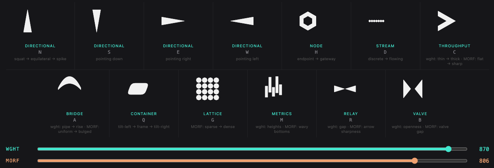
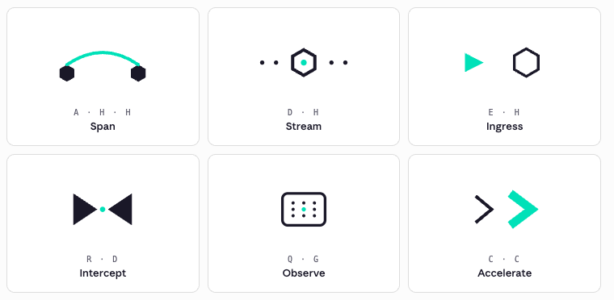

# SymbolLang

A parametric, two-axis variable TTF that encodes a 13-symbol visual language for systems, flows, and identities. Type a letter, get a glyph; move the sliders, change its state.


## What it is

- **13 primitives** mapped to ASCII letters: `N S E W` (directional triangles), `H` (hex node), `D` (dots), `C` (chevron), `A` (arc), `Q` (quad), `G` (grid), `M` (metrics), `R` (relay), `B` (bowtie). Both cases map to the same glyphs.
- **Two axes**, both `100..900`:
  - `wght` — UI label **Phase** — state intensity (dormant → saturated).
  - `MORF` — UI label **Form** — structural mode (diffuse → unified).
- **9 masters** on a 3×3 grid, **5 named instances** along Phase (Min / Low / Mid / High / Max) at Form=500.
- **One file**, ~5 KB.




## Build

Requires Python 3 + `fonttools`.

```bash
pip install fonttools
python build_symbolang.py                 # -> ./SymbolLang.ttf
python build_symbolang.py -o dist/Font.ttf
python build_symbolang.py --keep-masters  # keep the 9 intermediate TTFs
```

Intermediate masters land in a temp directory by default and are cleaned up after build. Script is standalone — no relative imports, no hardcoded paths.

## Use

Any host that supports variable fonts (modern browsers, Figma, Illustrator, InDesign, macOS Font Book 2022+).

```css
@font-face {
  font-family: 'SymbolLang';
  src: url('fonts/SymbolLang.ttf') format('truetype-variations');
}
.mark {
  font-family: 'SymbolLang';
  font-size: 240px;
  font-variation-settings: 'wght' 700, 'MORF' 500;
}
```

Write `HCH` and style it — you get a node-flow-node mark. See `GUIDE.md` for composition patterns and identity-design ideas.

You can mix and match glyphs to create new ones.



## Files

| File | Purpose |
|------|---------|
| `fonts/SymbolLang.ttf` | The font. |
| `build_symbolang.py` | Foundry script. Reproduces the font from scratch. |
| `SPEC.md` | Technical spec, current state, known edge cases. |
| `GUIDE.md` | Designer-facing guide: axes, composition patterns, showcase ideas. |
| `README.md` | This file. |

## Status

v5. Font and foundry script are stable and tested. The 3×3 master grid renders cleanly at all corners and interpolates smoothly in between. See `SPEC.md` for the pending items (notably: v5 preview HTML not yet rebuilt, and a few hand-tuned parameter tables that are brittle if new masters are added).

## License

TBD.
